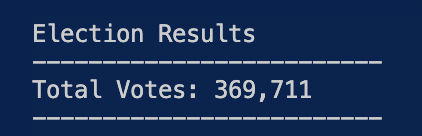
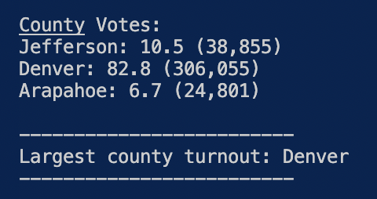
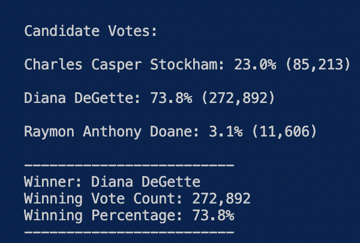

# Election_Analysis
---
## Overview of the elections audit
---

The purpose of the elections audit was to verify
  1. The total number of votes
  2. The vote count for each county and their respective percentages as a proportion ot the total votes
  3. The number of votes per candidate and their respective percentages as a proportion of total votes 
  4. The county with the largest voter turnout (winning county)
  5. The candidate with the highest number of votes (winning candidate)

---
## Elections audit results
---

The outcome of the elections was determined by running a script or python code "PyPoll_Challenge" to analyse the elections results which were collected into a csv file "election_results.csv" and the results of running this code/script was saved in the elections_analysis.txt file as well as the individual png files depicting the specific results as below.

![election_analysis]Analysis/Election_Results.txt)

A total of 369,711 votes were cast during the elections. 

The total number of votes by county was Jefferson 38,885, Denver 306,055 and Arapahoe 24,801 votes whilst the percentage of votes by county was 10.5%, 82.3% and 6.7% respectively. The winning county or county with the largest voter turnout was Denver with 306,055 votes which made up 82.8% of the total votes that were casted.

The total number of votes by candidate was Charles Casper 85,213, Diana DeGette 272,892 and Raymon Anthony Doane 11.606 votes whilst the percentage of votes by candidate was 23%, 73.8% and 3.1% respectively. The winning candidate or candidate with the lhighest number of votes was Diana DeGette with 272,892 votes which made up 73.8% of the total votes that were casted.

---
## Election audit summary
---

The elections audit python code/script can be used for future or upcoming elections so long as the column headers remain the same as well as the format remains the same. Information, as outlined under overview of the elections audit, and stated in the elections audit results above can be quickly generated to determine the winning candidate and county by votes and percentages. 
